# Vaultly Frontend (Vue 3)

A responsive banking demo frontend built with Vue 3, Vite, Pinia, PrimeVue, and Tailwind CSS.
It consumes the Laravel API for authentication, wallet operations, transaction history, beneficiaries, PIN flows, and profile management.


## Table of Contents

- [Why This Project](#why-this-project)
- [Live Demo](#live-demo)
- [Features](#features)
- [Core Flows and Demo](#core-flows-and-demo)
- [Tech Stack](#tech-stack)
- [System Highlights](#system-highlights)
- [Project Structure](#project-structure)
- [Architecture Deep Dive](#architecture-deep-dive)
- [Prerequisites](#prerequisites)
- [Scripts](#scripts)
- [Development Workflow](#development-workflow)
- [Build and Deployment Notes](#build-and-deployment-notes)
- [Known Constraints](#known-constraints)
- [FAQ and Troubleshooting](#faq-and-troubleshooting)
- [License](#license)
- [Future Improvements](#future-improvements)
- [Author](#author)

## Why This Project

Vaultly is a full-stack banking demo built to demonstrate real-world patterns — not just CRUD.
The backend enforces transactional integrity on all money movement (deposit, transfer, withdraw)
using database transactions with row-level locking to prevent race conditions. Auth is handled
via Laravel Sanctum bearer tokens. Media is managed through Cloudinary with deterministic
public ID tracking so profile pictures can be replaced or deleted cleanly without orphaning
assets. The frontend is a single-page Vue 3 app with Pinia state management, global 401
handling, and route ownership guards so users can't access each other's dashboard by changing
a URL param.

## Live Demo

- Frontend: https://vaultlydemo.vercel.app
- Backend API: https://laravellivebankapptest.onrender.com/api

## Features

- Secure authentication with protected dashboard routes
- Deposit, transfer, and withdrawal workflows
- Beneficiary management for faster repeat transfers
- Transaction history with credit/debit visibility
- Profile and account detail management
- Transaction PIN setup and update flows

## Core Flows and Demo

### Dashboard Overview

<p align="center">
    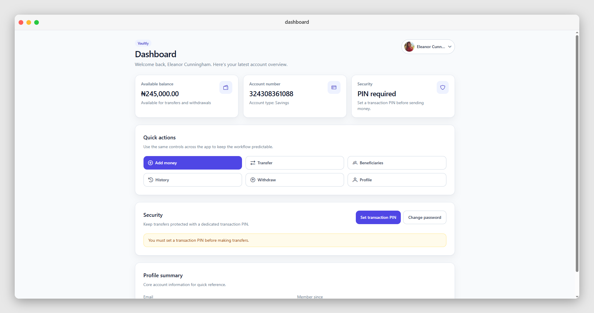
</p>

### Authentication Flow

<p align="center">
    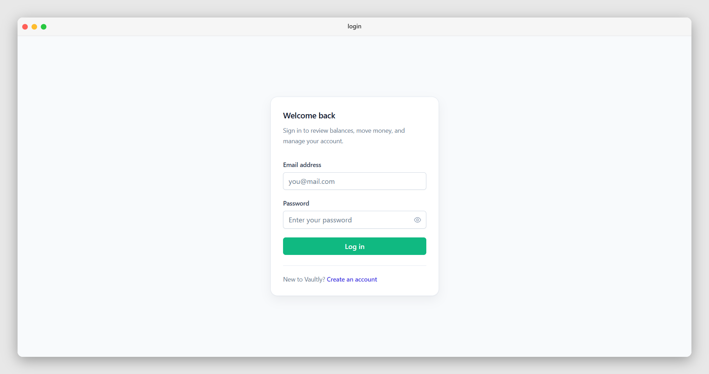
</p>

<details>
    <summary>See it in action</summary>
    <p align="center">
        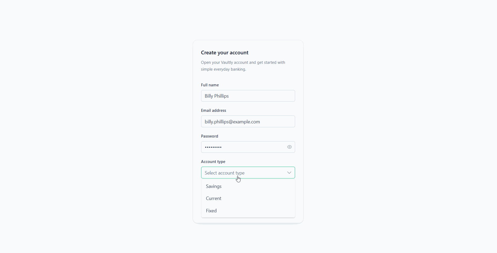
    </p>
</details>

### Deposit Flow

<p align="center">
    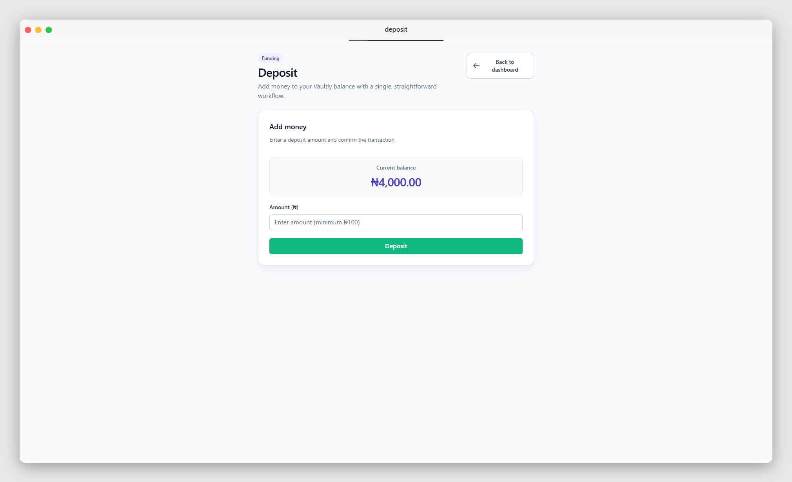
</p>

<details>
    <summary>See it in action</summary>
    <p align="center">
        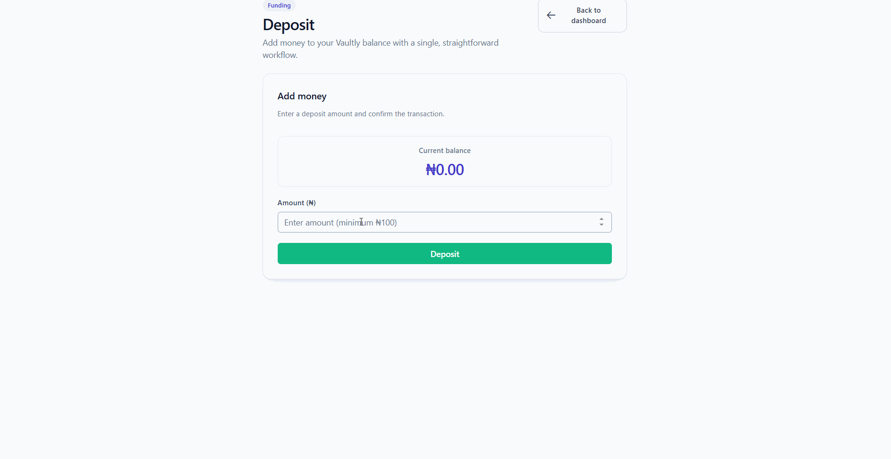
    </p>
</details>

### Transfer Flow

<p align="center">
    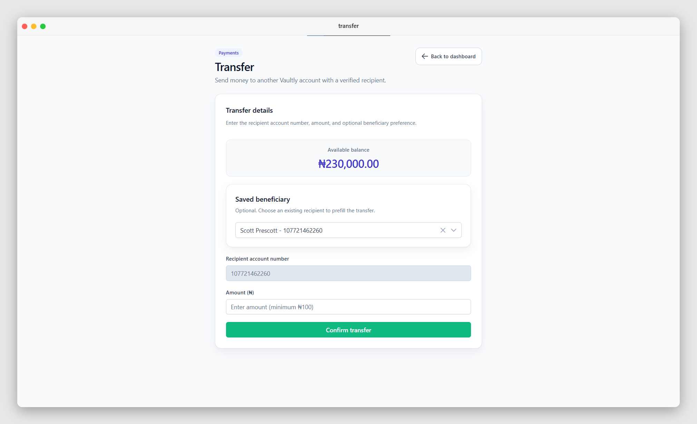
</p>

<details>
    <summary>See it in action</summary>
    <p align="center">
        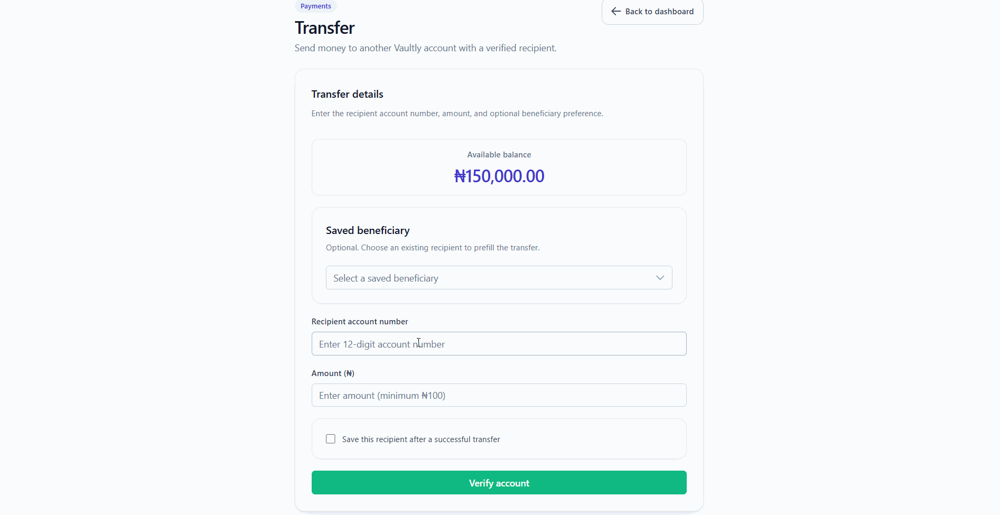
    </p>
</details>

### Beneficiaries Flow

<p align="center">
    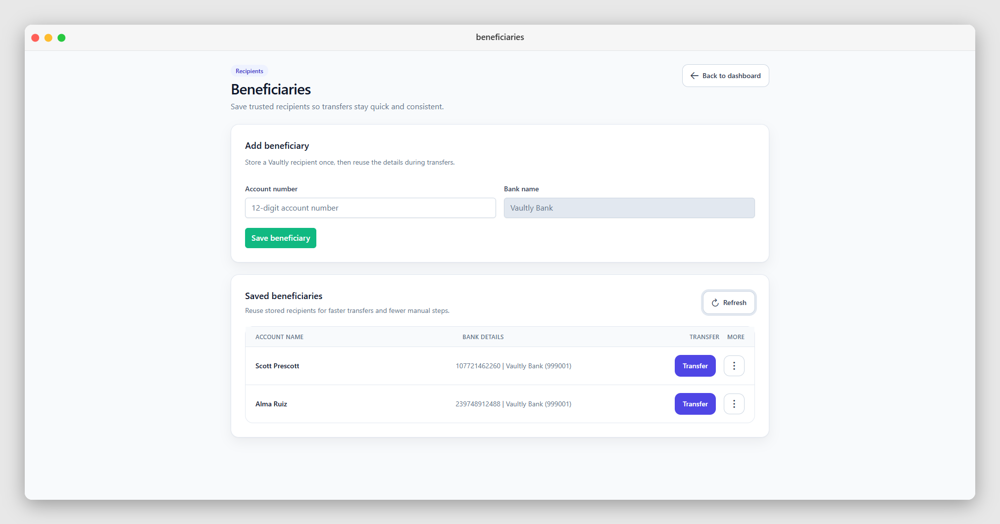
</p>

<details>
    <summary>See it in action</summary>
    <p align="center">
        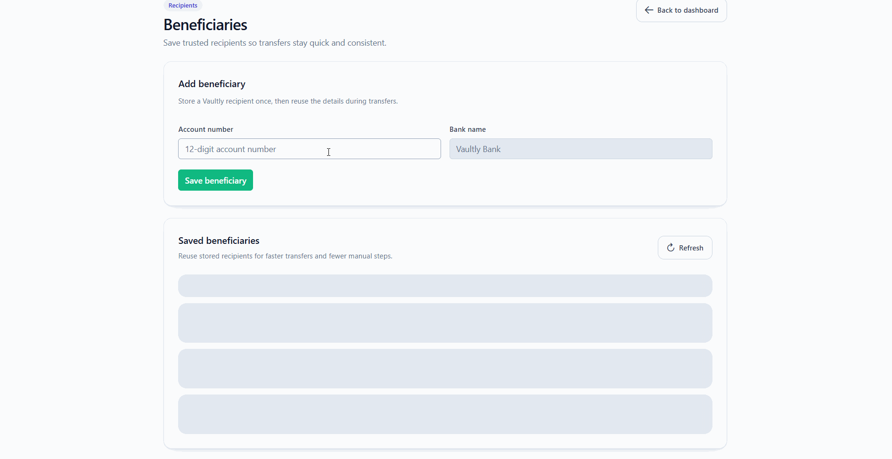
    </p>
</details>

### Transaction History Flow

<p align="center">
    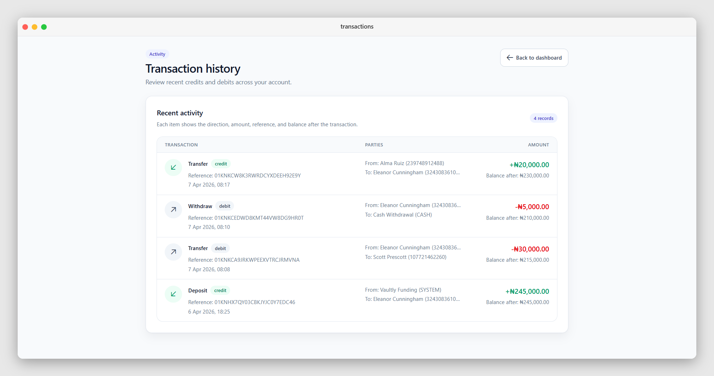
</p>

<details>
    <summary>See it in action</summary>
    <p align="center">
        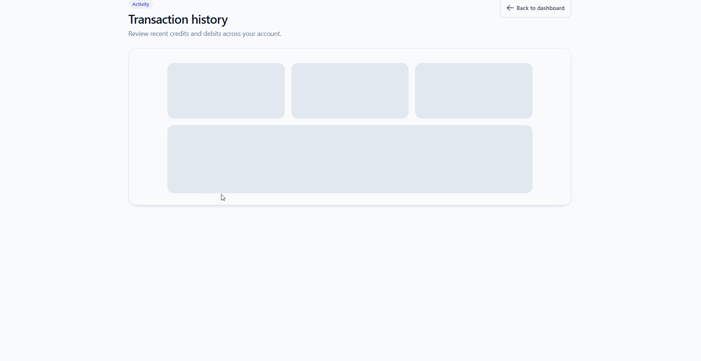
    </p>
</details>

### Profile Flow

<p align="center">
    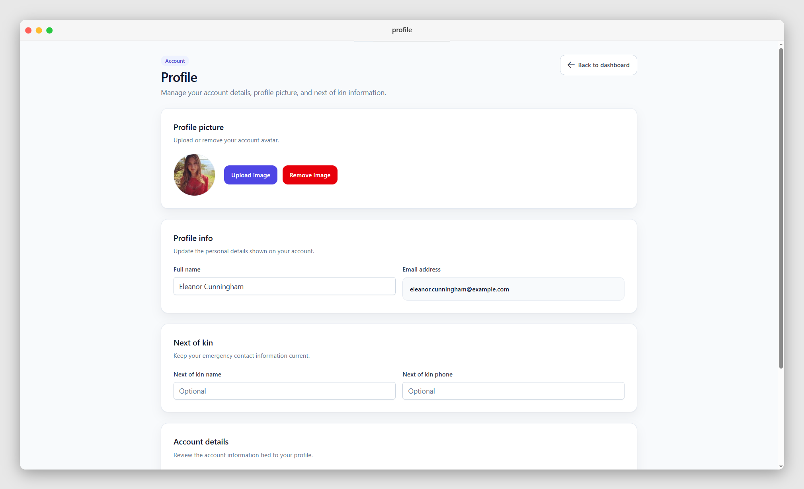
</p>

<details>
    <summary>See it in action</summary>
    <p align="center">
        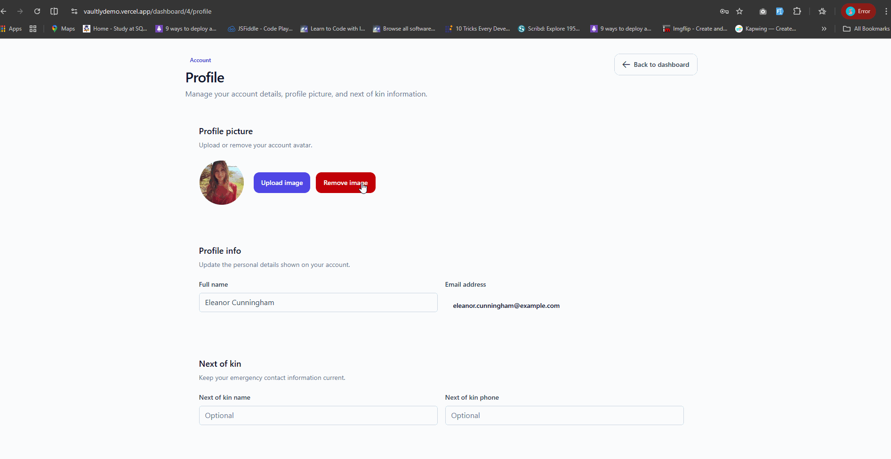
    </p>
</details>

## Tech Stack

- Vue 3
- Vue Router 4
- Pinia
- Axios
- PrimeVue + PrimeIcons
- Tailwind CSS 4
- Vite 6

## System Highlights

- Logic-first architecture: frontend flows are built against strict backend transaction rules.
- State and auth handling are centralized in Pinia with persisted token support.
- Route guards enforce authentication and user-level route ownership.
- Axios interceptors provide consistent API handling and global unauthorized-session behavior.
- UI polish phase introduced reusable UI primitives and standardized loading/feedback patterns.
- Deployment-ready setup with environment-based API configuration and Vercel hosting.

## Project Structure

```text
├── router/
│   └── index.js 	# Route definitions and navigation guards
└── src/
    ├── assets/
        ├── gifs/
        ├── screenshots/
    │   └── main.css
    ├── components/
    │   ├── ui/
    │   │   ├── FormCard.vue
    │   │   ├── PageWrapper.vue
    │   │   ├── SectionHeader.vue
    │   │   ├── StackedSkeleton.vue
    │   │   ├── StatCard.vue
    │   │   └── UserAvatarMenu.vue
    │   ├── Beneficiaries.vue
    │   ├── ChangePassword.vue
    │   ├── ChangePin.vue
    │   ├── DashBoard.vue
    │   ├── Deposit.vue
    │   ├── Home.vue
    │   ├── LogIn.vue
    │   ├── NotFound.vue
    │   ├── Profile.vue
    │   ├── SetPin.vue
    │   ├── SignUp.vue
    │   ├── TransactionHistory.vue
    │   ├── Transfer.vue
    │   └── Withdraw.vue
    ├── composables/
    │   └── useInputNormalization.js
    ├── stores/
    │   └── auth.js
    ├── utils/
    │   └── api.js
    ├── App.vue
    └── main.js
```

## Architecture Deep Dive

### Routing and Access Control

- Nested dashboard routes under `/dashboard/:userId` require auth.
- Route guards in `router/index.js`:
	- block unauthenticated access
	- hydrate user state after refresh
	- enforce route user ownership (`:userId` must match authenticated user)
	- redirect authenticated users away from auth pages

### State and Authentication

- Pinia auth store (`src/stores/auth.js`) holds:
	- access token (persisted in localStorage)
	- current user payload
	- helper actions for dashboard and balance refresh

### API Layer

- Axios instance in `src/utils/api.js`:
	- uses `VITE_API_BASE_URL` when provided
	- falls back to deployed API URL
	- auto-attaches Bearer token
	- handles 401 globally by clearing auth and redirecting to login with `sessionExpired=1`

### UI Patterns

- PrimeVue for dialogs, toasts, buttons, menus, skeletons.
- Non-inline global outcomes (success/failure) surfaced via toast.
- Reusable loading skeleton in `components/ui/StackedSkeleton.vue` to keep loading states consistent across pages.

## Prerequisites

- Node.js 18+
- npm 9+

### Install and Run

```bash
git clone https://github.com/SlinkyCollins/vaultly-frontend.git
cd vaultly-frontend
npm install
npm run dev
```

### Environment Variables

Create `.env` in `vaultly-frontend`:

```bash
VITE_API_BASE_URL=http://127.0.0.1:8000/api
```

For production, set it to your deployed backend API endpoint.

## Scripts

```bash
npm run dev      # start local dev server
npm run build    # production build
npm run preview  # preview production build locally
```

## Development Workflow

1. Start backend API first.
2. Set `VITE_API_BASE_URL` to backend `/api` root.
3. Run frontend with `npm run dev`.
4. Test complete user journey:
	 - register/login
	 - set PIN
	 - deposit
	 - transfer/withdraw
	 - beneficiaries/history/profile

## Build and Deployment Notes

- Build output is generated by Vite (`dist/`).
- Frontend is currently deployed to Vercel.
- Ensure backend CORS allows your frontend domain.

## Known Constraints

- Requires a reachable backend API URL to function.
- If backend is on free-tier hosting, first request may be delayed (cold start).
- Session expiry returns user to login by design.
- UI expects backend to return validation errors in Laravel-style structures.

## FAQ and Troubleshooting

### CORS errors in browser

- Confirm backend `CORS_ALLOWED_ORIGINS` includes your frontend origin.
- Confirm `VITE_API_BASE_URL` points to `/api` endpoint, not root domain only.

### Requests fail with 401 immediately

- Clear stale `access_token` from localStorage.
- Log in again to refresh token.

### Images or profile updates not reflecting

- Hard refresh browser cache.
- Verify backend Cloudinary configuration is valid.

## License

This project is for educational and portfolio/demo purposes.

## Future Improvements
- Add automated frontend tests for key transaction and auth paths.
- Expand transaction filtering and search controls.
- Add stronger analytics/insights on account activity.
- Improve accessibility coverage and keyboard-navigation feedback.
        
## Author
Built by SlinkyCollins as a full-stack portfolio project.

